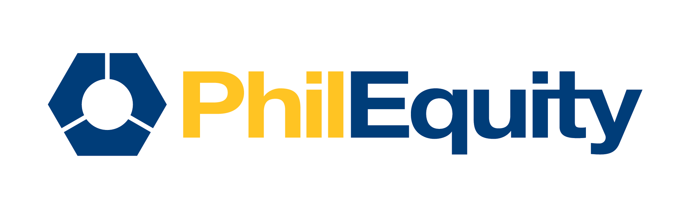

# 👋 Welcome to PEMI ClientEase GitHub Organization

Welcome to the **PEMI ClientEase** GitHub organization!  
**PEMI ClientEase** is a comprehensive **client management system** designed to help businesses streamline customer interactions, service requests, and data-driven decision-making.  

This organization is maintained by the **PEMI Development Team** and serves as the central hub for all projects related to **ClientEase**.  
Whether you're a new developer or a team lead, this repository will help you get started with our development processes, best practices, and technologies.

---

## 📂 Key Repositories

### 1️⃣ [PEMIClientEase.UI](https://github.com/PEMIClientEase/PEMIClientEase.UI) - The Frontend Application  
The **PEMIClientEase.UI** repository contains the **Angular-based** frontend of the ClientEase system. It provides a user-friendly interface for client management, reporting, and analytics.

#### 🛠️ Tech Stack:
- **Frontend Framework**: Angular  
- **UI Components**: PrimeNG, Bootstrap  
- **State Management**: RxJS  
- **Styling**: SCSS  
- **Build System**: Angular CLI  

#### 🚀 Features:
- Client profile management  
- Real-time updates and notifications  
- Advanced filtering and search  
- Dashboard with interactive visualizations  

---

### 2️⃣ [PEMIClientEase.APIs](https://github.com/PEMIClientEase/PEMIClientEase.APIs) - The Backend API  
The **PEMIClientEase.APIs** repository contains the **.NET-based** backend of the ClientEase system. It manages data processing, API endpoints, and integrates with the PostgreSQL database.

#### 🛠️ Tech Stack:
- **Backend Framework**: .NET Core  
- **Database**: PostgreSQL  
- **Authentication & Security**: JWT, OAuth2  
- **API Documentation**: Swagger  
- **Deployment**: Docker (Planned for future release)  

#### 🚀 Features:
- RESTful API for frontend communication  
- Secure user authentication  
- Data validation and business logic processing  
- Integration with external services  

---

## 🏁 Getting Started

### **1️⃣ Clone the Repositories**
```bash
git clone https://github.com/PEMIClientEase/PEMIClientEase.UI.git
git clone https://github.com/PEMIClientEase/PEMIClientEase.APIs.git
```

---

### **2️⃣ Setting Up the Frontend (Angular)**

#### **Step 1: Navigate to the frontend directory**
```bash
cd PEMIClientEase.UI
```

#### **Step 2: Install dependencies**
```bash
npm install
```

#### **Step 3: Run the development server**
```bash
ng serve
```
- The Angular app will be available at **`http://localhost:4200`**.

---

### **3️⃣ Setting Up the Backend (API - .NET Core)**

#### **Step 1: Navigate to the backend directory**
```bash
cd PEMIClientEase.APIs
```

#### **Step 2: Restore dependencies**
```bash
dotnet restore
```

#### **Step 3: Apply database migrations**
```bash
dotnet ef database update
```

#### **Step 4: Run the backend server**
```bash
dotnet run
```
- The API will be available at **`http://localhost:5000/api`**.

---

## 🔧 Contributing Guidelines

We encourage collaboration and contributions from the development team. Please follow these guidelines:

- **Branching Model**: Use `feature/`, `bugfix/`, or `release/` branches.
- **Commit Messages**: Write meaningful commit messages (e.g., `fix: resolve UI alignment issue on dashboard`).
- **Pull Requests**: All changes should be made through pull requests and will be reviewed before merging.
- **Code Standards**: Follow **Angular best practices** for frontend and **.NET Core best practices** for backend.

---

## 📞 Need Help?

If you have any questions, reach out to the **PEMI Development Team**:
- 📧 **Email**: support@pemi.com
- 🏢 **Office**: PEMI Headquarters, Manila, Philippines
- 📄 **Documentation**: [ClientEase Docs](https://docs.pemi.com)

For more information about **PEMI**, visit our website:  
🌐 [https://www.pemi.com](https://www.pemi.com)

---

Let's build **ClientEase** together! 🚀
