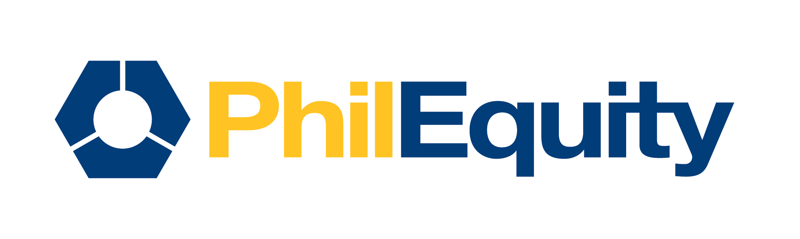

# 👋 Welcome to PEMI ClientEase GitHub Organization

Welcome to the **PEMI ClientEase** GitHub organization!  
**PEMI ClientEase** is a comprehensive **client management onboarding/updating system** designed to help PEMI streamline customer interactions, account opening, and account updating.  

This organization is maintained by the **PEMI Development Team** and serves as the central hub for all projects related to **ClientEase**.  
Whether you're a new developer or a team lead, this repository will help you get started with our development processes, best practices, and technologies.

---

## 📂 Key Repositories

### 1️⃣ [PEMIClientEase.UI](https://github.com/PEMIClientEase/PEMIClientEase.UI) - The Frontend Application  
The **PEMIClientEase.UI** repository contains the **Angular-based** frontend of the ClientEase system. It provides a user-friendly interface for client management, reporting, and analytics.

#### 🛠️ Tech Stack:
- **Frontend Framework**: Angular  
- **UI Components**: PrimeNG, PrimeFlex  
- **Styling**: CSS  
- **Build System**: Angular CLI  

#### 🚀 Features:
- Client profile onboarding and updating  
- Real-time updates and notifications  
- Advanced filtering and search  

---

### 2️⃣ [PEMIClientEase.APIs](https://github.com/PEMIClientEase/PEMIClientEase.CoreAPI) - The Backend APIs  
The **PEMIClientEase.APIs** repository contains the **.NET MVC-based** backend of the ClientEase system. It manages data processing, API endpoints, and integrates with the PostgreSQL database.

This repository consists of two projects:
- **PEMIClientEase.BusinessAPI** - Handles business logic, client interactions, and API endpoints.
- **PEMIClientEase.DataAccessAPI** - Manages database transactions and data storage.

#### 🛠️ Tech Stack:
- **Backend Framework**: ASP.NET Web API  
- **Database**: PostgreSQL  

#### 🚀 Features:
- RESTful API for frontend communication  
- Data validation and business logic processing  
- Integration with external services  

---

## 🏁 Getting Started

### **1️⃣ Clone the Repositories**
```bash
git clone https://github.com/PEMIClientEase/PEMIClientEase.UI.git
git clone https://github.com/PEMIClientEase/PEMIClientEase.APIs.git
```

---

### **2️⃣ Setting Up the Frontend (Angular)**

#### **Step 1: Navigate to the frontend directory**
```bash
cd PEMIClientEase.UI
```

#### **Step 2: Install dependencies**
```bash
npm install
```

#### **Step 3: Run the development server**
```bash
ng serve
```
- The Angular app will be available at **`http://localhost:4200`**.

---

### **3️⃣ Setting Up the Backend (API - .NET MVC)**

#### **Step 1: Navigate to the backend directory**
```bash
cd PEMIClientEase.APIs
```

#### **Step 2: Restore dependencies**
```bash
dotnet restore
```

#### **Step 3: Apply database migrations**
```bash
dotnet ef database update
```

#### **Step 4: Run the backend server**
```bash
dotnet run
```
- The API will be available at **`http://localhost:5000/api`**.

---

## 🔧 Contributing Guidelines (Draft)

We encourage collaboration and contributions from the development team. Please follow these guidelines:

- **Branching Model**: Use `<NameOfDeveloper>_PEMIClientEaseUI_Dev/`, or `<NameOfDeveloper>_PEMIClientEaseAPIs_Dev/` branches.
- **Commit Messages**: Write meaningful commit messages (e.g., `fix: resolve UI alignment issue on dashboard`).
- **Pull Requests**: All changes should be made through pull requests and will be reviewed before merging.
- **Code Standards**: Follow **Angular best practices** for frontend and **.NET MVC best practices** for backend.

---

Let's build **ClientEase** together! 🚀
